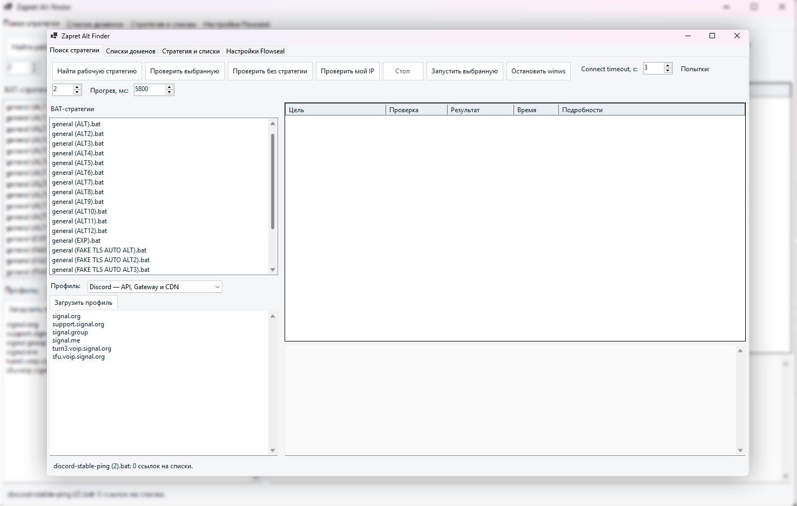
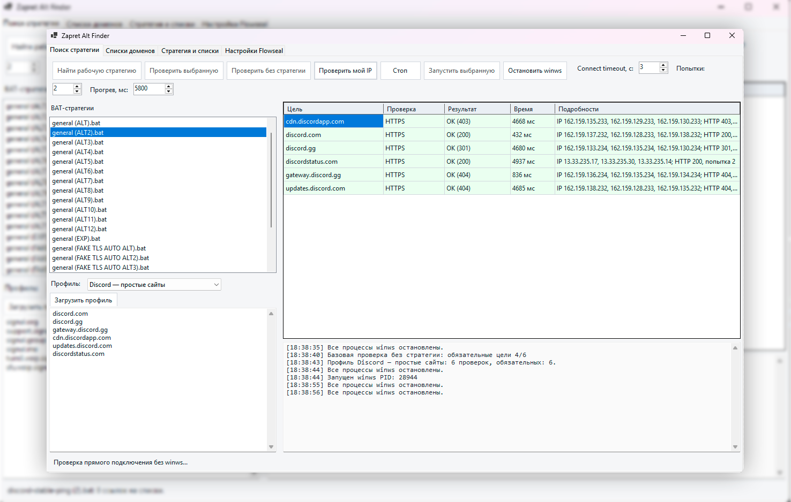

<h1 align="center">❛❜ Zapret Alt Finder ❛❜</h1>

  ╔══════════════════════════════════════╗ 
  ☆ Windows GUI для Zapret и WinWS ☆ 
  ╚══════════════════════════════════════╝

  <a href="https://github.com/ZloboocGip/ZapretAltFinder/releases/latest">« Скачать последнюю версию »</a>

## ✧ Что это

Zapret Alt Finder — программа для поиска и проверки ALT-стратегий WinWS.

Она помогает проверить сайты и сервисы, выбрать рабочую стратегию, запускать её и управлять списками Zapret без ручного редактирования BAT-файлов.

## ☆ Установка

❛ 1. Скачай EXE из [Releases](https://github.com/ZloboocGip/ZapretAltFinder/releases)  
❛ 2. Помести EXE в корень готовой папки Zapret  
❛ 3. Запусти программу от имени администратора  

Структура папки:

    zapret/
    ╠══ ZapretAltFinder.exe
    ╠══ bin/
    ╠══ lists/
    ╚══ utils/

## ✧ Возможности

☁ Автоматический перебор ALT-стратегий WinWS  
☁ Проверка сайтов и сервисных профилей без стратегии  
☁ Запуск и остановка выбранной стратегии  
☁ Профили Discord, Roblox, Steam, YouTube, Signal, WhatsApp, Telegram и других сервисов  
☁ Проверка HTTPS, DNS, WebSocket и UDP  
☁ Редактирование доменных и IP-листов  
☁ Исключение стратегий из перебора без удаления BAT-файлов  
☁ Автозапуск через Планировщик задач Windows  
☁ Проверка своего или указанного вручную IP-адреса  

## ✧ Скриншоты

  

  

## ❛ Важно ❜

╠═ Программа рассчитана на готовую папку Zapret  
╠═ Рядом с EXE должны быть папки bin, lists и utils  
╠═ Одновременно должна работать только одна стратегия WinWS  
╠═ Ошибка DNS не всегда означает недоступность всего сервиса  
╚═ UDP-проверка не заменяет реальное подключение к голосовому каналу или игре  

## ☆ Основа

‹ [Flowseal/zapret-discord-youtube](https://github.com/Flowseal/zapret-discord-youtube) ›  
‹ [bol-van/zapret-win-bundle](https://github.com/bol-van/zapret-win-bundle) ›

## ✧ Обратная связь

Нашёл ошибку или есть идея?  
« [Создать Issue](https://github.com/ZloboocGip/ZapretAltFinder/issues/new/choose) »

〞 Автор: [@taiufun](https://t.me/taiufun) 〝
